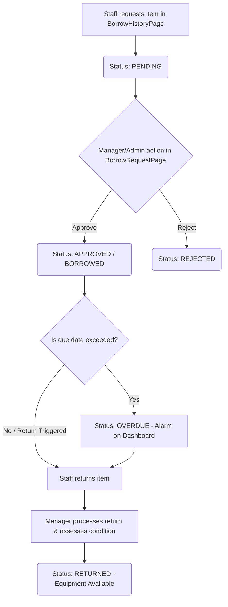

# JIT Inventory & Equipment Management System — User Manual

Welcome to the **JIT Inventory & Equipment Management System** user manual. This guide is designed to help Staff, Managers, and Admins navigate and utilize the system to manage the full lifecycle of physical equipment, consumable items, software licenses, borrowing requests, maintenance logs, and procurement purchase orders.

---

## Table of Contents

1. [System Overview & Architecture](#1-system-overview--architecture)
2. [User Roles & Permissions Matrix](#2-user-roles--permissions-matrix)
3. [Getting Started & Authentication](#3-getting-started--authentication)
4. [Dashboard & Alerts Quick Guide](#4-dashboard--alerts-quick-guide)
5. [Inventory & Category Management](#5-inventory--category-management)
6. [Equipment Borrowing Lifecycle](#6-equipment-borrowing-lifecycle)
7. [Equipment Maintenance & Repairs](#7-equipment-maintenance--repairs)
8. [Equipment Disposal](#8-equipment-disposal)
9. [Procurement & Purchase Orders (PO)](#9-procurement--purchase-orders-po)
10. [Reports & System Audit Trail](#10-reports--system-audit-trail)
11. [Troubleshooting & FAQ](#11-troubleshooting--faq)

---

## 1. System Overview & Architecture

The JIT Inventory & Equipment Management System is designed to centralize and automate asset lifecycle operations, replacing manual tracking spreadsheets. The codebase is organized into frontend interfaces and backend services:

- **Frontend App**: Built with React 19 and Tailwind CSS v4, containing client-side pages in the `apps/frontend/src/pages/` directory.
- **Backend API**: An Express application using Prisma ORM to interact with PostgreSQL, containing routes in `apps/backend/src/routes/` and business logic services in `apps/backend/src/services/`.

---

## 2. User Roles & Permissions Matrix

The system enforces database-driven Role-Based Access Control (RBAC) with three pre-defined roles.

| Feature / Action              | Admin | Manager | Staff | Primary File Reference                                                                                                               |
| :---------------------------- | :---: | :-----: | :---: | :----------------------------------------------------------------------------------------------------------------------------------- |
| View Dashboard & KPIs         |  Yes  |   Yes   |  Yes  | [DashboardPage.tsx](file:///c:/Users/Admin/Desktop/jit-inventory-system/apps/frontend/src/pages/DashboardPage.tsx)                   |
| Request Equipment Borrowing   |  Yes  |   Yes   |  Yes  | [BorrowHistoryPage.tsx](file:///c:/Users/Admin/Desktop/jit-inventory-system/apps/frontend/src/pages/BorrowHistoryPage.tsx)           |
| Review & Approve Borrowing    |  Yes  |   Yes   |  No   | [BorrowRequestPage.tsx](file:///c:/Users/Admin/Desktop/jit-inventory-system/apps/frontend/src/pages/BorrowRequestPage.tsx)           |
| Trigger Overdue Status Checks |  Yes  |   Yes   |  No   | [BorrowRequestPage.tsx](file:///c:/Users/Admin/Desktop/jit-inventory-system/apps/frontend/src/pages/BorrowRequestPage.tsx)           |
| Manage Categories & Suppliers |  Yes  |   Yes   |  No   | [CategoryManagementPage.tsx](file:///c:/Users/Admin/Desktop/jit-inventory-system/apps/frontend/src/pages/CategoryManagementPage.tsx) |
| Log & Process Purchase Orders |  Yes  |   Yes   |  No   | [PurchaseOrderPage.tsx](file:///c:/Users/Admin/Desktop/jit-inventory-system/apps/frontend/src/pages/PurchaseOrderPage.tsx)           |
| Manage Equipment Maintenance  |  Yes  |   Yes   |  No   | [MaintenancePage.tsx](file:///c:/Users/Admin/Desktop/jit-inventory-system/apps/frontend/src/pages/MaintenancePage.tsx)               |
| Approve Equipment Disposals   |  Yes  |   No    |  No   | [EquipmentPage.tsx](file:///c:/Users/Admin/Desktop/jit-inventory-system/apps/frontend/src/pages/EquipmentPage.tsx)                   |
| View System Audit Logs        |  Yes  |   No    |  No   | [AuditLogsPage.tsx](file:///c:/Users/Admin/Desktop/jit-inventory-system/apps/frontend/src/pages/AuditLogsPage.tsx)                   |
| User Account Administration   |  Yes  |   No    |  No   | [UserManagementPage.tsx](file:///c:/Users/Admin/Desktop/jit-inventory-system/apps/frontend/src/pages/UserManagementPage.tsx)         |

---

## 3. Getting Started & Authentication

### Logging In

1. Open the application in your browser:
   - **Production Deployment**: Open `http://localhost` (or the server's LAN IP address `http://<server-ip>`).
   - **Local Development**: Open `http://localhost:3000`.
2. The login screen ([LoginPage.tsx](file:///c:/Users/Admin/Desktop/jit-inventory-system/apps/frontend/src/pages/LoginPage.tsx)) will appear.
3. Enter your corporate email and password.
4. Click **Sign In**.

> [!NOTE]
> The system uses a secure two-token JWT authentication strategy. Your access token is stored safely in temporary memory (Zustand), and the refresh token is kept in an HTTP-only cookie.
>
> - In a local environment running on plain HTTP, the cookie is dynamic (`COOKIE_SECURE=false`).
> - In standard production deployments, `COOKIE_SECURE` should be set to `true` with HTTPS enabled to prevent session hijacking over corporate WiFi.

---

## 4. Dashboard & Alerts Quick Guide

The Dashboard ([DashboardPage.tsx](file:///c:/Users/Admin/Desktop/jit-inventory-system/apps/frontend/src/pages/DashboardPage.tsx)) serves as the system landing page.

- **KPI Cards**: Displays counts for Total Assets, Available Equipment, Low-Stock items, and Overdue Borrows.
- **Notification Bell**: Displays live, unread notifications for low-stock triggers, upcoming warranty expiries, and overdue borrow status updates.
- **System Warning Banners**:
  - **Low Stock Alerts**: Displays bulk consumable items that have dropped below their defined reorder point.
  - **Overdue Equipment Alerts**: Critical alerts showing equipment currently unreturned past their due date, complete with the borrower's name and contact details.

---

## 5. Inventory & Category Management

### Categories

Before registering items, categories must be configured in [CategoryManagementPage.tsx](file:///c:/Users/Admin/Desktop/jit-inventory-system/apps/frontend/src/pages/CategoryManagementPage.tsx):

1. Click **Categories** in the navigation bar.
2. Click **+ Add Category**.
3. Provide a Name, Description, and select the **Item Type**:
   - `EQUIPMENT`: Serialized physical devices (e.g., Laptop, Keyboard, Monitor).
   - `CONSUMABLE`: Bulk items tracked by quantity (e.g., RJ45 Connectors, Batteries, HDMI Cables).
   - `DIGITAL_ASSET`: Licenses and software keys (e.g., Adobe CC subscription, domain registrations).
4. Save the Category.

### Registering Items & Bulk Management

Manage catalog items in [InventoryManagementPage.tsx](file:///c:/Users/Admin/Desktop/jit-inventory-system/apps/frontend/src/pages/InventoryManagementPage.tsx):

- **Create Item**: Click **+ Add Item**, assign it to a category, write a description, upload a picture, and save.
- **Consumables Stocking**: Consumables are logged with their stock unit (e.g., Pieces, Boxes) and a **Reorder Point**.
  - Use **Stock In / Stock Out** actions to manually adjust counts, which registers a record in the stock movements ledger.
- **Equipment Specific Profile**: Saving an item classified under the `EQUIPMENT` category generates an entry in the equipment ledger ([EquipmentPage.tsx](file:///c:/Users/Admin/Desktop/jit-inventory-system/apps/frontend/src/pages/EquipmentPage.tsx)) where individual Serial Numbers, Brand, Model, Condition (New, Good, Fair, Poor), and Location must be added.

---

## 6. Equipment Borrowing Lifecycle

Equipment borrowing follows a strict request-review-return flow:

### Step 1: Submitting a Borrow Request (Staff)

1. Navigate to **My Borrow History** ([BorrowHistoryPage.tsx](file:///c:/Users/Admin/Desktop/jit-inventory-system/apps/frontend/src/pages/BorrowHistoryPage.tsx)).
2. Click **+ Request Equipment**.
3. Select the equipment item from the available listing, choose the target **Expected Return Date**, and write purpose notes.
4. Click **Submit Request**. The request is logged as `PENDING`.

### Step 2: Approving or Rejecting Requests (Manager/Admin)

1. Go to **Borrow Requests** ([BorrowRequestPage.tsx](file:///c:/Users/Admin/Desktop/jit-inventory-system/apps/frontend/src/pages/BorrowRequestPage.tsx)).
2. Locate the pending request.
3. Review notes and return date, then click **Approve** or **Reject** (requiring rejection reasons).
4. On approval, the equipment's status atomically updates to `BORROWED`, locking it from other requests.

### Step 3: Returning Equipment

1. When the staff member returns the physical item, a Manager or Admin must locate the active record in [BorrowRequestPage.tsx](file:///c:/Users/Admin/Desktop/jit-inventory-system/apps/frontend/src/pages/BorrowRequestPage.tsx).
2. Click **Process Return**.
3. Select the item's return condition (Good, Fair, Poor).
4. Save the entry. The item status transitions back to `AVAILABLE`.

### Step 4: Overdue Checks

1. Managers can click the **Run Overdue Check** button in [BorrowRequestPage.tsx](file:///c:/Users/Admin/Desktop/jit-inventory-system/apps/frontend/src/pages/BorrowRequestPage.tsx) to scan all records.
2. Any items past their return date are updated to `OVERDUE`, triggering dashboard warnings and email alerts.

---

## 7. Equipment Maintenance & Repairs

Equipment that is broken or requires checkups should be routed to Maintenance ([MaintenancePage.tsx](file:///c:/Users/Admin/Desktop/jit-inventory-system/apps/frontend/src/pages/MaintenancePage.tsx)):

1. Navigate to **Maintenance**.
2. Click **+ Log Maintenance**.
3. Select the target asset. Eligible items must be in `Good`, `Fair`, or `Poor` condition and not currently borrowed.
4. Enter the maintenance details, set status to `UNDER_MAINTENANCE` (or `SCHEDULED` for future checkups), and select the performer.
5. While maintenance is active, the equipment's availability remains locked.
6. Once repairs are completed, update the maintenance log status to `COMPLETED`, specify the resolution details, and assign the new condition status. The equipment will automatically return to service as `AVAILABLE`.

---

## 8. Equipment Disposal

When an equipment asset becomes obsolete, gets lost, or is damaged beyond repair, it must be officially decommissioned using the Disposal workflow in [EquipmentPage.tsx](file:///c:/Users/Admin/Desktop/jit-inventory-system/apps/frontend/src/pages/EquipmentPage.tsx):

1. Find the asset in the **Equipment** table.
2. Select **Dispose Asset** from the actions menu.
3. Select a reason: `DAMAGED`, `OBSOLETE`, or `SOLD`.
4. Provide purchase price details and disposal notes.
5. Click **Submit**.

> [!IMPORTANT]
> To prevent unauthorized asset decommissions, disposals must be reviewed and approved by an **Admin**. Once approved, the item's status transitions to `DISPOSED` and it is soft-deleted from active listings but preserved in historical logs.

---

## 9. Procurement & Purchase Orders (PO)

Managers and Admins can coordinate inventory replenishment through the Purchase Orders workflow ([PurchaseOrderPage.tsx](file:///c:/Users/Admin/Desktop/jit-inventory-system/apps/frontend/src/pages/PurchaseOrderPage.tsx)):

### Step 1: Manage Suppliers

1. Navigate to **Suppliers** ([SupplierManagementPage.tsx](file:///c:/Users/Admin/Desktop/jit-inventory-system/apps/frontend/src/pages/SupplierManagementPage.tsx)).
2. Add suppliers, capturing contact names, phone numbers, email addresses, and locations.

### Step 2: Create a PO

1. Go to **Purchase Orders** ([PurchaseOrderPage.tsx](file:///c:/Users/Admin/Desktop/jit-inventory-system/apps/frontend/src/pages/PurchaseOrderPage.tsx)).
2. Click **+ Create Purchase Order**.
3. Select the supplier.
4. Add items from the catalog, specify quantities, and set costs. The total PO cost is calculated automatically.
5. Click **Save as Draft** or **Submit for Approval**.

### Step 3: PO Lifecycle Processing

POs progress through the following statuses:

- `DRAFT` — Order is being compiled.
- `PENDING_APPROVAL` — Sent to managers/admins.
- `APPROVED` — Authorized to place order.
- `ORDERED` — Placed with supplier.
- `RECEIVED` — Inventory delivered. Receiving a PO automatically prompts you to log item intakes:
  - For consumables, stock quantities automatically increase.
  - For equipment, users are prompted to generate individual Asset IDs and serial numbers.
- `CANCELLED` — Voided order.

---

## 10. Reports & System Audit Trail

### Generating Reports

Navigate to the Reports module ([ReportsPage.tsx](file:///c:/Users/Admin/Desktop/jit-inventory-system/apps/frontend/src/pages/ReportsPage.tsx)):

1. Choose report type: **Current Inventory Summary** or **Audit Ledger Summary**.
2. Select target filters (e.g., date ranges, categories, or transaction types).
3. Click **Export to Excel** (`.xlsx` file) or **Export to PDF** (`.pdf` document).

### System Audit Trail

Admins can navigate to **Audit Logs** ([AuditLogsPage.tsx](file:///c:/Users/Admin/Desktop/jit-inventory-system/apps/frontend/src/pages/AuditLogsPage.tsx)) to view a read-only list of every single action performed in the system:

- Shows who performed the action, which table was modified, when it occurred, and provides a raw JSON representation of the "before" and "after" state.

---

## 11. Troubleshooting & FAQ

#### Q: Why is my borrow request still shown as "Pending"?

**A**: Borrow requests must be approved by a Manager or Admin. If they haven't reviewed it, the request remains pending. Reach out to an inventory administrator.

#### Q: How are "Low Stock Alerts" triggered?

**A**: Consumable profiles specify a **Reorder Point** value. When stock counts drop to or below this point, a warning is raised in the notifications dropdown and on the dashboard.

#### Q: What is an Asset ID vs a Serial Number?

**A**:

- **Asset ID** is a unique, human-readable identifier generated by the system (e.g., `JIT-EQ-0105`) for internal tracking and barcoding.
- **Serial Number** is the manufacturer's serial code stamped on the hardware (e.g., `S/N: 82FX291X04`).

#### Q: An item was returned but is still flagged as "Borrowed".

**A**: The staff member cannot close a borrow record themselves. A Manager or Admin must process the return in [BorrowRequestPage.tsx](file:///c:/Users/Admin/Desktop/jit-inventory-system/apps/frontend/src/pages/BorrowRequestPage.tsx) to officially check the item back in.
