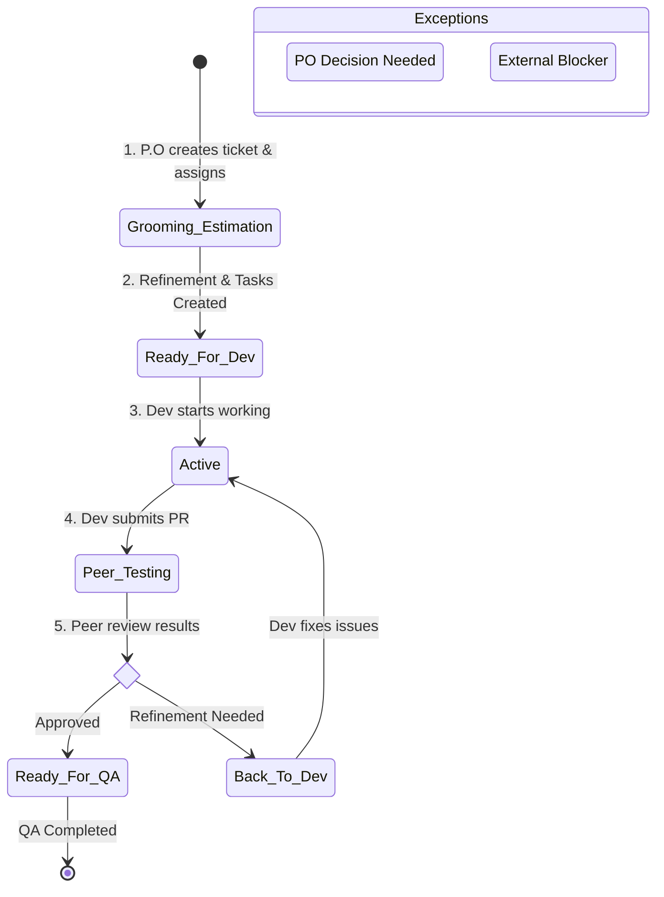

# JIT Inventory & Equipment Management System — Developer User Manual

Welcome to the **Developer User Manual**. This guide documents our core internal development processes, code commit guidelines, pull request protocols, and the ticket lifecycle workflow in Azure DevOps. All developers onboarding or working on the JIT Inventory System must adhere strictly to these rules to maintain project quality and team alignment.

---

## Table of Contents

1. [Local Development Processes](#1-local-development-processes)
2. [Commit Guidelines & Code Quality Checklist](#2-commit-guidelines--code-quality-checklist)
   - [2.1 Commit Message Format (Conventional Commits)](#21-commit-message-format-conventional-commits)
3. [Pull Request (PR) Protocols](#3-pull-request-pr-protocols)
   - [3.1 Branch Naming Convention](#31-branch-naming-convention)
   - [3.2 Target Integration Branch](#32-target-integration-branch)
   - [3.3 Pull Request Template Requirement](#33-pull-request-template-requirement)
4. [Azure DevOps Ticket Management Workflow](#4-azure-devops-ticket-management-workflow)
5. [Database Change Process](#5-database-change-process)

---

## 1. Local Development Processes

The JIT Inventory System is managed as a monorepo using **Turborepo**. Follow these steps to set up and run the codebase locally.

### Environment Setup

1.  **Clone the Repository**:
    ```bash
    git clone https://github.com/jairosoft-com/jit-inventory-system.git
    cd jit-inventory-system
    ```
2.  **Install Monorepo Dependencies**:
    ```bash
    npm install
    ```
3.  **Configure Local Environment Settings**:
    - Duplicate the template file: `cp .env.example .env`
    - Adjust configurations (e.g., `DATABASE_URL`, `JWT_ACCESS_SECRET`, `REDIS_URL`, etc.). Refer to the `TECHNICAL_MANUAL.md` for details on each parameter.

### Infrastructure & Database Setup

1.  **Boot Core Support Services**:
    Spin up PostgreSQL, MinIO, Redis, and MailDev containers in the background:
    ```bash
    docker compose up postgres minio maildev redis -d
    ```
2.  **Initialize Relational Database Schema**:
    Generate the Prisma client, apply migrations, and seed default roles and users:

    ```bash
    # Generate schema clients
    npm run db:generate

    # Run PostgreSQL migrations and seed RBAC/initial data
    npm run db:migrate
    ```

### Launching Applications

- **Run All Applications Concurrently**:
  Start the frontend and backend live reload dev servers together:
  ```bash
  npm run dev
  ```

  - **Frontend Web App**: Access at `http://localhost:3000`
  - **Backend API Service**: Running at `http://localhost:3001`
- **Run Applications Individually**:

  ```bash
  # Run Frontend Only
  npm run dev --workspace=apps/frontend

  # Run Backend Only
  npm run dev --workspace=apps/backend
  ```

---

## 2. Commit Guidelines & Code Quality Checklist

Before committing any code to version control, verify that your changes adhere to the following checklist. Doing so ensures clean code review cycles and prevents broken pipelines.

- **No Secrets or Credentials**: Never commit `.env` files, API keys, private certificates, or local configurations to Git.
- **Targeted Commits**: Do not include unrelated edits or layout format sweeps alongside your functional task code.
- **Linting & Code Formatting**: Run code checks to ensure conformity to the project style:

  ```bash
  # Lint files
  npm run lint

  # Format files using Prettier
  npm run format
  ```

- **Local Testing Verification**: Ensure unit and integration tests compile and pass before pushing:
  ```bash
  npm run test --workspace=apps/backend
  ```
- **Error Handling**: Wrap network requests, DB transactions, and unsafe parses in robust error handlers, returning clear message states rather than allowing the process to crash.
- **Documentation updates**: Keep the `TECHNICAL_MANUAL.md` updated if you modify schemas, configurations, or introduce new modules.

### 2.1 Commit Message Format (Conventional Commits)

We enforce the **Conventional Commits** format for all commit messages:

```
<type>(<scope>): <description>

[optional body]

[optional footer(s)]
```

#### Valid Types

| Type       | Description                                                  |
| :--------- | :----------------------------------------------------------- |
| `feat`     | A new user-facing feature                                    |
| `fix`      | A bug fix                                                    |
| `docs`     | Documentation changes only                                   |
| `style`    | Code style/formatting changes (whitespace, semicolons, etc.) |
| `refactor` | Code refactoring without behavior change                     |
| `test`     | Adding or updating tests                                     |
| `chore`    | Build process, CI/CD pipelines, or developer tool changes    |
| `perf`     | Performance improvements                                     |

#### Valid Scopes

Specify the app, module, or database package being modified, such as: `frontend`, `backend`, `prisma`, `shared`, `auth`, `inventory`, `equipment`, `borrow`, etc.

#### Examples

- `feat(backend): implement JWT refresh token rotation`
- `fix(inventory): prevent stock quantity from going below zero`
- `docs(readme): add environment variable documentation`
- `chore(ci): add type-check step to GitHub Actions pipeline`

---

## 3. Pull Request (PR) Protocols

To integrate features or fixes, developers must follow the structured pull request pipeline.

### 3.1 Branch Naming Convention

All branches created in the repository must follow our standard prefixing conventions to easily identify the type of work they contain:

| Prefix      | Purpose                                  | Example                                |
| :---------- | :--------------------------------------- | :------------------------------------- |
| `feature/`  | New features or functionality            | `feature/borrow-workflow`              |
| `bugfix/`   | Bug fixes                                | `bugfix/stock-quantity-race-condition` |
| `hotfix/`   | Critical production fixes                | `hotfix/auth-token-refresh`            |
| `chore/`    | Non-code updates (CI/CD, docs, configs)  | `chore/update-ci-pipeline`             |
| `refactor/` | Code refactoring without behavior change | `refactor/prisma-service-cleanup`      |

#### Branch Flow Hierarchy

Branches flow sequentially from features up to production:

```
main ← develop ← feature/your-feature
```

- **`main`**: Production-ready code. This is a protected branch.
- **`develop`**: Central integration branch.

### 3.2 Target Integration Branch

All work branches (e.g., `feature/ticket-101`, `bugfix/alert-overflow`) must be created off the latest state of the `develop` branch.

- **All Pull Requests must target the `develop` branch.** Pushing directly to `main` or `release/*` is restricted.

### 3.3 Pull Request Template Requirement

Every pull request must utilize and fully fill out the [pull_request_template.md](file:///c:/Users/Admin/Desktop/jit-inventory-system/pull_request_template.md). This template forces standardized review documentation:

1.  **Ticket / Task**: Specify the ticket ID (e.g., `#1054`) or the exact task name from Azure DevOps.
2.  **Summary**: Provide a high-level explanation of the target goal and changes.
3.  **Changes Made**: Provide a bulleted list of modified directories, schema alterations, or store state additions.
4.  **How to Test**: Document exact step-by-step instructions for peer testers to verify execution.
5.  **Screenshots / Recording**: If the changes involve UI adjustments, drag and drop visual proof (images, video logs) directly into the PR description.
6.  **Checklist**:
    - [ ] Created from latest `develop` branch
    - [ ] Tested locally
    - [ ] Did not commit `.env` or secret keys
    - [ ] Did not include unrelated changes
    - [ ] Added error handling where needed
    - [ ] Updated documentation if needed
7.  **Notes**: Document any known issues, external blockers, or specific warnings reviewers must keep in mind.

---

## 4. Azure DevOps Ticket Management Workflow

We use Azure DevOps to coordinate agile tasks and sprints. Every ticket's board column represents the physical state of the development task. Developers are responsible for maintaining exact columns for their tickets:



### Steps & State Transitions

1.  **Ticket Creation**: The Product Owner (P.O) creates the necessary ticket outlining the requirements for feature development, bug fixes, or system refinement, placing it on the backlog.
2.  **Refinement & Tasks**: Once a ticket is assigned, the developer moves the ticket to the **Grooming** or **Estimation** column. During this phase, the developer refines requirements and breaks the ticket down into individual sub-tasks.
3.  **Ready for Dev**: Once all sub-tasks are created and estimated, the developer moves the ticket to the **Ready for Dev** column, indicating it is queued for active coding.
4.  **Active Work**: When the developer begins coding, writing tests, or configuring features, they move the ticket to the **Active** column. No ticket should sit in "Active" unless work is currently ongoing.
5.  **Peer Testing (Code Review)**: When the developer completes all tasks, passes local tests, fills out the `pull_request_template.md`, and submits a pull request to the `develop` branch, they move the ticket to the **Peer Testing** column.
6.  **Code Approval / QA Gate**:
    - **Approved**: If the peer reviewer tests the branch according to the "How to Test" guidelines and approves the PR, the peer tester moves the ticket to the **Ready for QA** column.
    - **Rejected / Issues Found**: If the peer reviewer discovers code flaws or testing bugs, the peer tester moves the ticket to the **Back to Dev** column. The developer must address these and move it back through Active -> Peer Testing.
7.  **On Hold & Blocked Columns**:
    - **On Hold**: If a ticket's requirements change or need critical clarification from the Product Owner, the developer moves it to **On Hold**.
    - **Blocked**: If the developer faces an external blocker (e.g., API server offline, missing credentials from vendor) that prevents work, the developer moves the ticket to **Blocked** until resolved.

---

## 5. Database Change Process

When modifying the database schema or seed data, follow this strict 7-step process to ensure database schemas remain synchronized across all team members and the shared environment:

1.  **Edit Schema**: Make changes to the database structure in [schema.prisma](file:///c:/Users/Admin/Desktop/jit-inventory-system/prisma/schema.prisma).
2.  **Generate Local Migration**: Run the migration script to apply the changes to your local PostgreSQL instance and generate the migration files:
    ```bash
    npm run db:migrate
    ```
    This script generates SQL files inside the `prisma/migrations/` directory.
3.  **Update Seeds**: If your changes introduce new tables, roles, permissions, or system metadata, add the corresponding records to [seed.ts](file:///c:/Users/Admin/Desktop/jit-inventory-system/prisma/seed.ts).
4.  **Commit Code & Migrations**: Commit both your schema updates and the generated migration SQL files together.
5.  **Declare Migrations in PR**: In your PR description, **explicitly state that this PR contains database migrations** to alert other team members.
6.  **Deploy to Shared Database**: Once the PR is approved and merged into the `develop` branch, **the author of the PR is responsible for executing the migration against the shared database instance** using Prisma deploy commands:
    ```bash
    npx prisma migrate deploy
    ```
7.  **Sync Local Environments**: When pulling updates from the `develop` branch, teammates must run migrations locally to stay in sync:
    ```bash
    npx prisma migrate deploy
    ```
    If new seed data is present, run:
    ```bash
    npx prisma db seed
    ```
